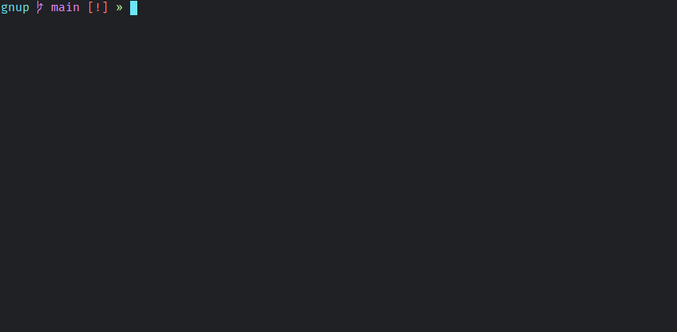

# gnup

A bash script for easy access and templating of frequently used commands.



## Install

```bash
git clone https://github.com/runarsf/gnup
cd gnup
sudo make install
```

### Dependencies

- fzf

## Uninstall

```bash
sudo make uninstall
```

## Usage

One command per line.\
The *magic variables* `__file` and `__path` are supported.\
Template tokens are formatted as `<token>` and can be reused.\
Template tokens can also be formatted as arrays: `<:item1,item2:>`.

## *commands*-file match detection (ordered by priority)

- Command-argument
- Local: `./commands`
- Git: `commands` within a git repo
- Global: `~/.config/commands`
- Global: `~/.commands`
